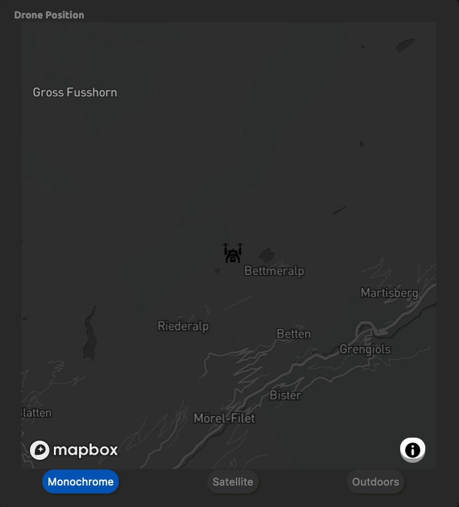
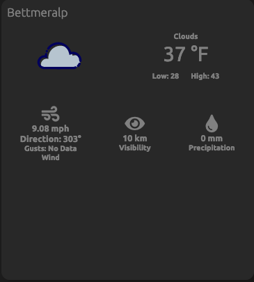
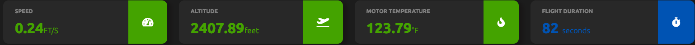
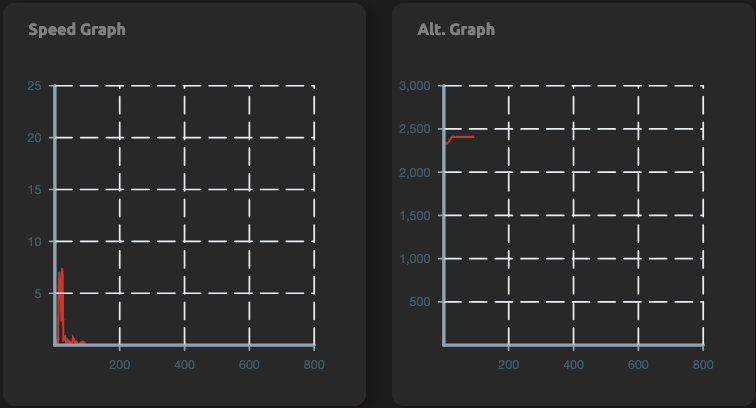

# Drone Dash

This project was the capstone in my DigitalCrafts bootcamp. It was truly an interesting and fun way to finish out the 16-weeks and showcase my skills in a short window. The app uses the entire stack; the front is React, the back is Node/Express, and PostgreSQL handles the big data. While I'm happy with this start, there is more work that can be done to make this even better.

## Features

 

### APIs

- [Mapbox / React-Map-GL](https://visgl.github.io/react-map-gl/)
- [OpenWeather](https://openweathermap.org/)

Mapbox uses the React Map GL wrapper in React and this is what renders the drone icon on screen. While the app is running a drone flight, it dynamically changes the map position of a drone icon on the screen. I thought this library would work better since it was a library that was created for Mapbox by Uber, and I'm pretty happy with how it turned out as well as the ease of implementation.

OpenWeather is a simple dataset that has plenty of endpoints for gathering many different weather data points that you could find interesting. I included it because I wanted to give users a quick weather overview of their location so they would be able to fly without inclement weather issues.

### Statistics

Users want to be able to see as much pertinent data as possible when trying to use the drones, so I tried to accomodate this in my build. One of the first thigns I did was create a small, quick statistic panel that would allow users to see the 4 data points that my drones' flight data included. Now, if I had different data points then this panel would probably have been differently rendered or I would have included a way for users to choose what data they wanted to see.
The panels also include color coded 'buttons' on the right that change when certain thresholds are met. This lets the user know if something is out of sorts or they should be alerted if they are too hot or too close to the ground.
  

Similarly, I wanted graphical data to be available to keep track of the data point history. For this I used the [Victory](https://formidable.com/open-source/victory/) charts library. Just like the statistical panel, if I had more data points then would have included a way to allow users to choose which data they wanted to track.
  

### Drones

The drones were not owned by me or data I created, but were given to my by someone else. Each of the 5 flight data is identical in structure ; a JSON object with a latitude, longitude, altitude, speed, temp, and duration key. I started streaming my flights to the dashboard from the front of the application, then gradually moved them to my Express server where they were axiosed in from the front. Finally I created a Postgres SQL database in Elephant SQL that held the data with a new custom key whiched named which drone flight it was. In the future, I want to add two more features to this app. First, I want to rebuild the backend to be a Websocket and Socket.IO server that streams flight data to the front. This way a user can see current flights in action. Second, I want to give users the ability to save the content of everyflight they make and load them up to play back historical flights for any reason.
